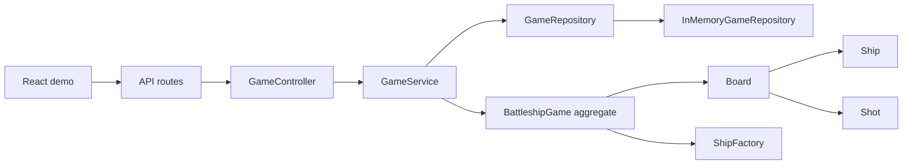
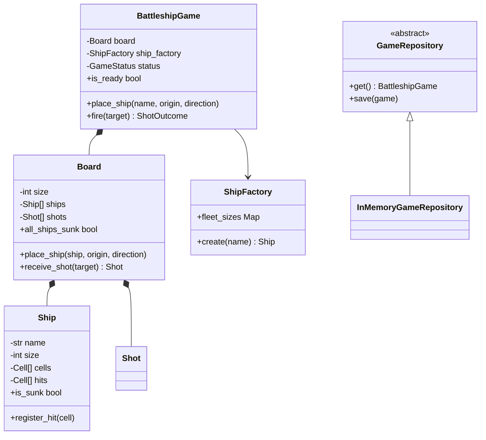
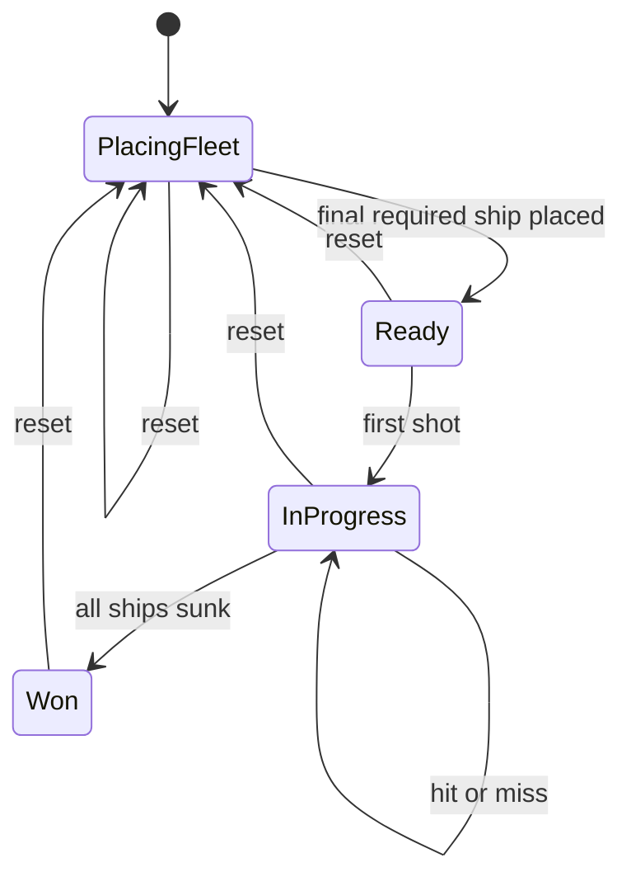
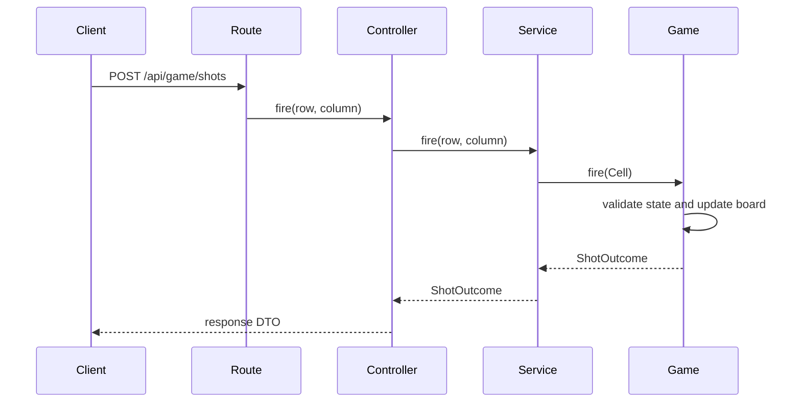

# Battleship Low-Level Design

## 1. Architecture

Dependencies move inward toward the models. Domain models do not import FastAPI, Pydantic, controllers, or repositories.

## 2. Package responsibilities

| Package | Responsibility |
|---|---|
| `models` | Game state and invariants: board, ships, cells, shots, status transitions. |
| `exceptions` | Named domain failures; no HTTP knowledge. |
| `factories` | Constructs supported ship types from the fleet configuration. |
| `repositories` | Abstracts where the current game is stored. |
| `services` | Implements application use cases and coordinates repository access. |
| `controllers` | Converts domain objects into stable response DTOs. |
| `api` | HTTP schemas, routes, and exception-to-status mapping. |
| `main.py` | Composition root; creates and wires concrete dependencies. |

## 3. Domain model

## 4. State transitions

## 5. Request sequence

## 6. Patterns used

- **Aggregate Root:** `BattleshipGame` is the only public coordinator for state transitions.
- **Repository:** `GameRepository` isolates storage; `InMemoryGameRepository` is the machine-coding adapter.
- **Factory:** `ShipFactory` centralizes valid ship types and their sizes.
- **Service Layer:** `GameService` exposes application use cases without transport logic.
- **Controller:** `GameController` maps model objects to the external response shape.
- **Composition Root:** `main.py` owns dependency construction; classes do not instantiate their own infrastructure dependencies.

## 7. Decisions and trade-offs

1. The `Board` owns placement and hit detection because those rules require knowledge of all cells and ships.
2. `Ship` owns its hit set and sunk calculation; the service does not inspect or mutate internal collections.
3. Collections are exposed as tuples or frozen sets to prevent accidental mutation.
4. `BattleshipGame` uses a re-entrant lock so placement, firing, and state transitions are atomic in this in-memory implementation.
5. Domain exceptions remain independent of HTTP. The API adapter maps malformed commands to `400` and state conflicts to `409`.
6. The sample models one game. Supporting many games requires a `game_id` repository key, not changes to `Board`, `Ship`, or shooting rules.

## 8. Deliberately out of scope

- Two-player turn orchestration
- Random/computer fleet placement
- Authentication and multiple concurrent game IDs
- Persistence and event history
- WebSocket updates

These are extension points, not missing responsibilities in the scoped aggregate.

## 9. Complexity

For board width `N` and fleet cell count `F`:

| Operation | Time | Space |
|---|---:|---:|
| Place a ship of length `L` | `O(F + L)` | `O(L)` |
| Fire | `O(number of ships × average ship length)` | `O(1)` plus stored shot |
| Serialize game | `O(F + shots)` | `O(F + shots)` response |

An `N × N` cell index could make hit lookup constant time, but the current representation is clearer for an 8×8 interview board. The design documents the optimization boundary without paying its complexity early.

## 10. Production evolution

For a networked, multi-game implementation:

1. key the repository by `game_id` and add optimistic versioning;
2. authenticate players and authorize actions against game membership;
3. persist commands or domain events for replay and audit;
4. make commands idempotent so client retries do not duplicate shots;
5. use compare-and-swap on the game version to prevent concurrent turns;
6. publish committed events through an outbox before WebSocket fan-out;
7. expose metrics for invalid commands, conflicts, latency, and active games.

The aggregate remains the consistency boundary. A distributed lock is not a substitute for a durable version check at the storage boundary.
