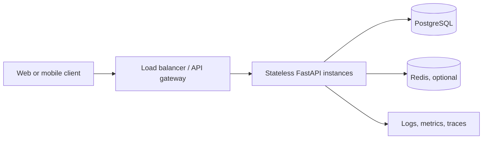

# Production-Readiness Plan

The current application is a correct single-process demonstration. Production
readiness requires changing the state-management and operational model without
moving game rules into infrastructure code.

## Target architecture



API instances must be stateless. Any instance should be able to process the
next command for a game.

## 1. Game identity and access

Replace the singleton endpoints with game resources:

```text
POST /api/v1/games
GET  /api/v1/games/{game_id}
POST /api/v1/games/{game_id}/ships
POST /api/v1/games/{game_id}/shots
```

Each game stores an owner or participant list. Authentication establishes the
caller; authorization verifies that the caller may view or mutate that game.
Opponent views must hide unhit ship locations.

## 2. Durable state and concurrency

A practical first schema is a `games` table containing:

- `id`
- `owner_id`
- `status`
- serialized game state
- `version`
- `created_at` and `updated_at`

Each command runs in a database transaction:

1. Read the game and its version.
2. Rehydrate the domain aggregate.
3. Execute the domain command.
4. Update using `WHERE id = ? AND version = ?`.
5. Increment the version.

If no row is updated, another command won the race. Return a conflict response
or retry when safe. This optimistic-concurrency approach works across processes
and hosts; Python locks do not.

Add an idempotency key to command requests if clients may retry after timeouts.

## 3. Stable API contracts

- Version the API under `/api/v1`.
- Define explicit request and response DTOs instead of returning internal model
  shapes.
- Return stable error codes such as `SHIP_OVERLAP` alongside readable messages.
- Include `game_id`, `version`, and request correlation ID in responses.
- Generate and validate an OpenAPI contract in CI.

## 4. Security

- Use TLS and an external identity provider.
- Authorize every game lookup and command.
- Maintain an environment-specific CORS allowlist.
- Apply request-size limits and per-user/IP rate limits.
- Keep secrets in a managed secret store and rotate them.
- Run dependency and container-image scanning in CI.

## 5. Reliability and operations

- Add liveness and readiness endpoints.
- Use structured logs with request, user, game, and correlation identifiers.
- Record request latency, error rate, command conflicts, and active games.
- Trace API and database calls with OpenTelemetry.
- Configure timeouts, graceful shutdown, and bounded database pools.
- Back up persistent state and test restoration.
- Define an availability and latency SLO before choosing alert thresholds.

## 6. Testing strategy

Keep the current fast domain tests, then add:

- Repository contract tests that run against every implementation.
- API schema and authorization tests.
- Persistence round-trip tests.
- Concurrent-command tests using the version field.
- End-to-end tests covering create, place, fire, win, and reconnect.
- Load tests based on expected active games and shot rate.
- Failure tests for database timeouts, retries, and process restarts.

## 7. Delivery

- Pin runtime dependencies and commit lock files.
- Build a minimal non-root container image.
- Run formatting, static analysis, tests, dependency scanning, and image scanning
  in CI.
- Use database migrations and backward-compatible API changes.
- Deploy gradually with health checks and automatic rollback signals.

## Recommended order

| Priority | Change | Reason |
|---|---|---|
| P0 | Game IDs, ownership, PostgreSQL repository, optimistic concurrency | Correctness and horizontal scaling |
| P0 | Authentication, authorization, hidden opponent views | Data and game integrity |
| P0 | Versioned DTOs and stable error codes | Client compatibility |
| P1 | Logs, metrics, traces, health endpoints | Operability |
| P1 | Idempotency, timeouts, retry policy | Reliable command execution |
| P1 | CI/CD, container hardening, migrations | Safe delivery |
| P2 | Redis caching | Only after measurement shows a need |
| P2 | WebSockets and event history | Only for real-time multiplayer requirements |

The production path preserves the domain model. The largest change is replacing
process-local state with a transactional repository and adding game identity,
not rewriting placement or shooting logic.
