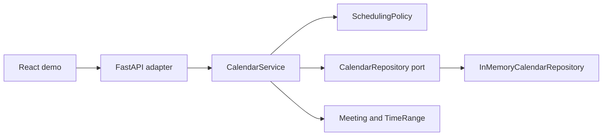
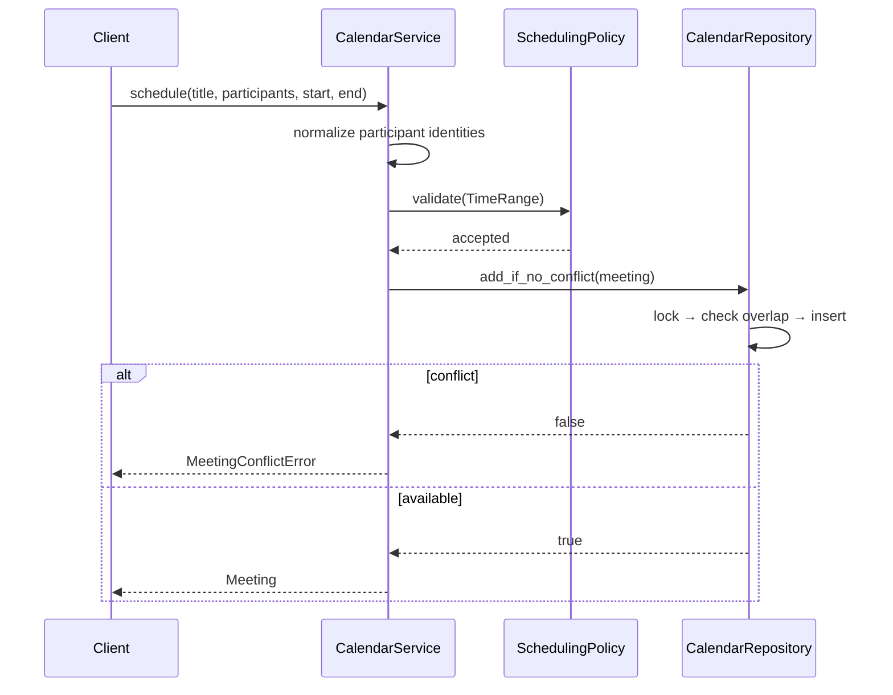

# Calendar Meet Booking — Low-Level Design

## 1. Scope and invariants

This is a single-process, in-memory scheduling service. Its important rules are:

- participant identity is trimmed and case-insensitive;
- a meeting has a non-empty title and at least one participant;
- time is a half-open interval, `[start, end)`;
- meetings must fit inside the configured working day;
- any shared participant makes overlapping meetings conflict;
- conflict check and insert happen as one atomic repository operation.

Time-zone conversion is intentionally out of scope. The API accepts local, offset-free date-times. A production API should accept an IANA time-zone identifier, convert to UTC for storage, and preserve the source zone for display.

## 2. Architecture and dependency direction

The domain and application layers have no dependency on FastAPI or storage details. `main.py` is the composition root and chooses the concrete repository and policy.

## 3. Responsibilities

| Component | Responsibility | Must not do |
|---|---|---|
| `TimeRange` | Validate temporal order and implement half-open overlap | Know about HTTP or persistence |
| `Meeting` | Protect title and participant invariants; answer conflict questions | Query other meetings |
| `SchedulingPolicy` | Define working hours and availability slot size | Store meetings |
| `CalendarService` | Normalize commands and orchestrate use cases | Implement locking |
| `CalendarRepository` | Define required persistence capabilities | Expose storage collections |
| `InMemoryCalendarRepository` | Atomically check conflicts and insert | Contain presentation logic |
| HTTP adapter | Validate shape, map errors, serialize responses | Own scheduling rules |

## 4. Main collaboration

The repository owns the check-and-write atomicity. A service-level `list` followed by `add` would be subject to a time-of-check/time-of-use race.

## 5. Patterns and SOLID choices

- **Value Object:** `TimeRange` is immutable and owns interval semantics.
- **Policy / Strategy:** `SchedulingPolicy` is injected, so offices with different hours or slot sizes do not require use-case changes.
- **Repository:** `CalendarRepository` isolates storage and gives the application a small capability-oriented port.
- **Application Service:** `CalendarService` coordinates domain objects without transport knowledge.
- **Dependency Inversion:** the service depends on a protocol, while `main.py` supplies the in-memory adapter.
- **Composition Root:** object construction is centralized rather than hidden in domain classes.

No pattern is added for recurrence, reminders, or rooms because those variation points are outside the requirements.

## 6. Complexity

With `M` meetings and `S` generated slots:

| Operation | Time | Space |
|---|---:|---:|
| List meetings | `O(M log M)` | `O(M)` snapshot |
| Schedule | `O(M)` conflict scan | `O(1)` excluding stored meeting |
| Availability | `O(S × M)` | `O(S)` |

This is appropriate for an interview-scale data set. At scale, index by participant and time range instead of scanning all meetings.

## 7. Concurrency and consistency

The adapter uses one re-entrant lock for reads and writes. This gives a coherent process-local snapshot and prevents two simultaneous schedule commands from both passing conflict detection.

For production:

1. persist meetings in a relational database;
2. run conflict detection and insertion in one transaction;
3. use a participant/time-range index and database locking or exclusion constraints;
4. retry serialization failures with a bounded policy;
5. make request IDs and audit events observable.

A normal index alone does not prevent overlapping intervals; the database constraint or locking design must encode that invariant.

## 8. Extension examples

- **Rooms:** model a room as another exclusive resource and include it in conflict evaluation.
- **Variable duration search:** generate candidates from the policy and reject intervals that overlap a participant calendar.
- **Multiple offices:** select a `SchedulingPolicy` using an office identifier at the application boundary.
- **Recurring meetings:** expand a command into occurrences, then commit the series atomically or report all conflicts.

## 9. Deliberately out of scope

- authentication and authorization;
- attendee acceptance states;
- rooms and equipment;
- reminders and notifications;
- recurrence;
- cross-time-zone conversion;
- durable persistence and multi-process coordination.

These are production evolution items, not hidden responsibilities of the scoped solution.
