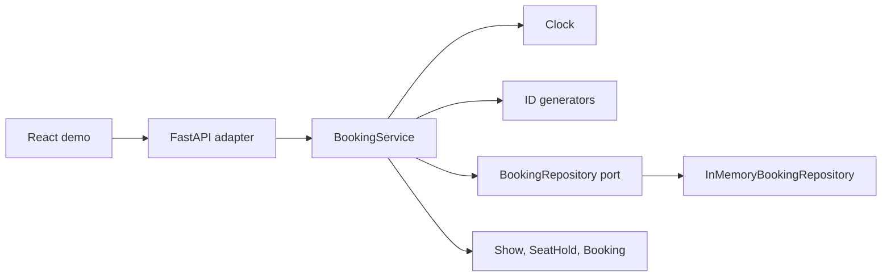
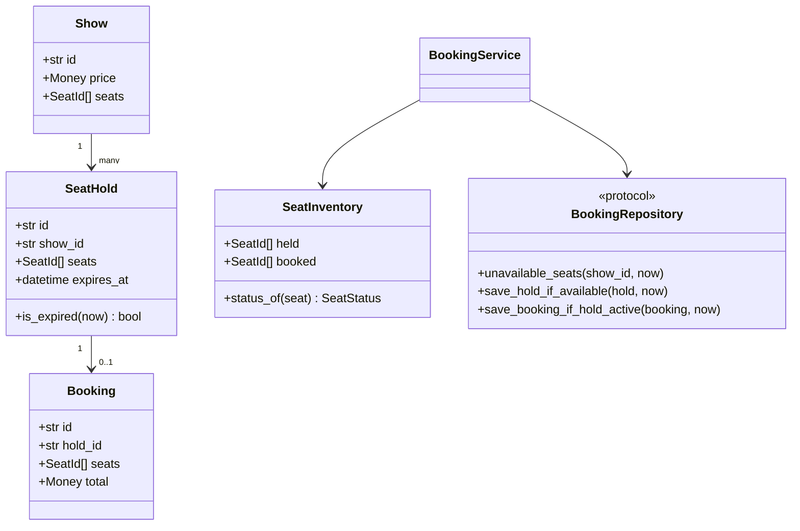
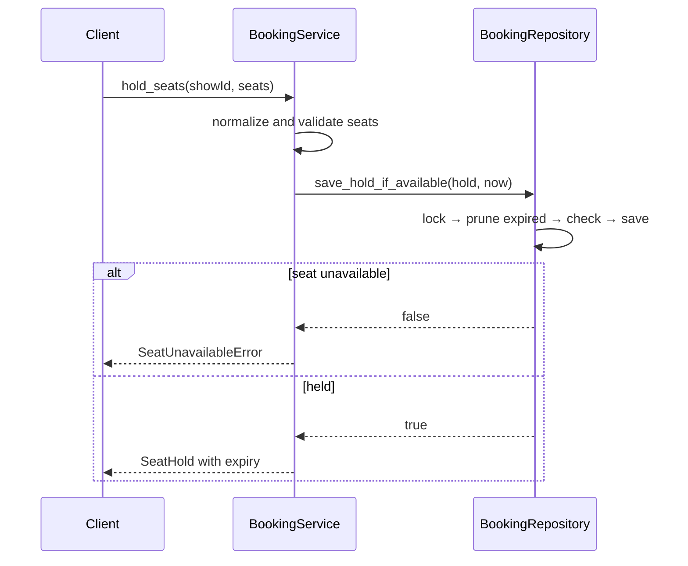
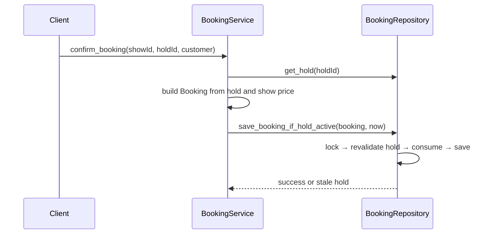

# Movie Ticket Booking — Low-Level Design

## 1. Scope and invariants

The service models show-level seat inventory with a two-step hold/confirm workflow.

- a show has a positive price and a non-empty, canonical seat set;
- requested seats must be valid, distinct, and non-empty;
- one seat can have at most one active hold or confirmed booking per show;
- a hold expires at `now >= expires_at`;
- only an active hold can become a booking;
- confirmation consumes the hold and permanently allocates its seats;
- availability checks and writes are atomic inside the repository adapter.

## 2. Architecture

Clock and ID generation are injected seams. Tests can control expiry and identifiers without patching global functions.

## 3. Domain model

The consistency boundary is the inventory of one show. `SeatInventory` is an immutable read snapshot containing held and booked seats from the same lock acquisition.

## 4. Hold sequence

## 5. Confirm sequence

The service performs an early check for a useful error, but the repository revalidates under the write lock. Correctness does not rely on the earlier read.

## 6. Patterns and SOLID choices

- **Entity:** `SeatHold` and `Booking` have identity and lifecycle.
- **Immutable Snapshot:** `SeatInventory` prevents callers from combining independently read held/booked collections.
- **Repository:** persistence capabilities are expressed through `BookingRepository`.
- **Application Service:** `BookingService` orchestrates pricing, expiry, and commands.
- **Dependency Injection:** repository, clock, duration, and ID generators are supplied from outside.
- **Lazy Expiration:** expired holds are pruned when inventory is read or a new hold is attempted.
- **Composition Root:** `main.py` chooses adapters without coupling them to the domain.

## 7. Complexity

With `H` holds, `B` bookings, and `N` seats in a show:

| Operation | Time | Space |
|---|---:|---:|
| Seat map | `O(H + B + N)` | `O(N)` |
| Hold seats | `O(H + B + requested seats)` | `O(requested seats)` |
| Confirm | `O(B + held seats)` | `O(held seats)` |

These scans keep the interview implementation readable. Production storage needs indexed seat allocations.

## 8. Production consistency design

The process-local lock is not sufficient across replicas. A production adapter should:

1. store one allocation row per `(show_id, seat_id)`;
2. represent `HELD` and `BOOKED` with hold/booking ownership and expiry;
3. acquire rows in a stable seat order inside a transaction;
4. enforce uniqueness for active allocation at the database boundary;
5. condition confirmation on the same hold owner and non-expired timestamp;
6. use database time to avoid clock skew between application nodes;
7. add an idempotency key to hold and confirm commands;
8. publish booking events with a transactional outbox.

For high contention, rejected transactions are expected. Measure conflict rate and use bounded retries with jitter; never solve double booking with an eventually consistent cache lock alone.

## 9. Deliberately out of scope

- payment authorization and compensation;
- authentication and per-user hold limits;
- cancellation, refunds, and seat changes;
- dynamic pricing and seat categories;
- idempotency keys;
- durable storage, outbox delivery, and multi-region inventory ownership.

These belong in the production evolution path and should be discussed explicitly in a staff-level interview.
